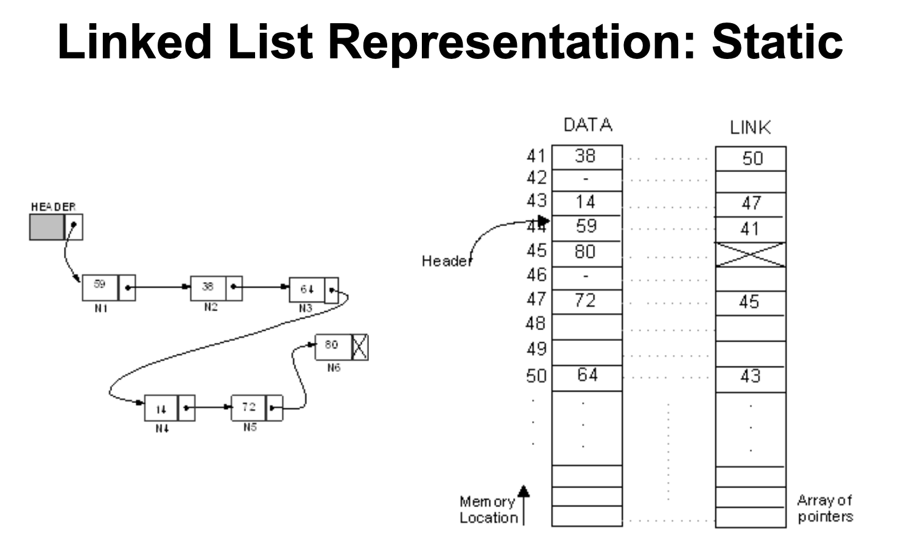
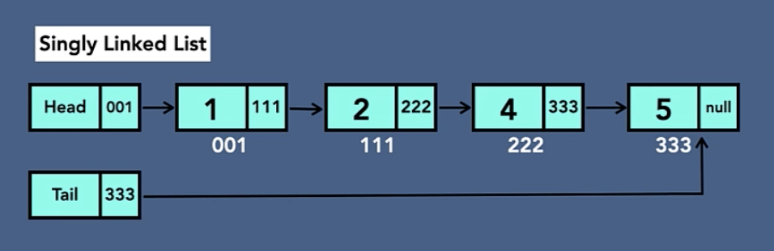
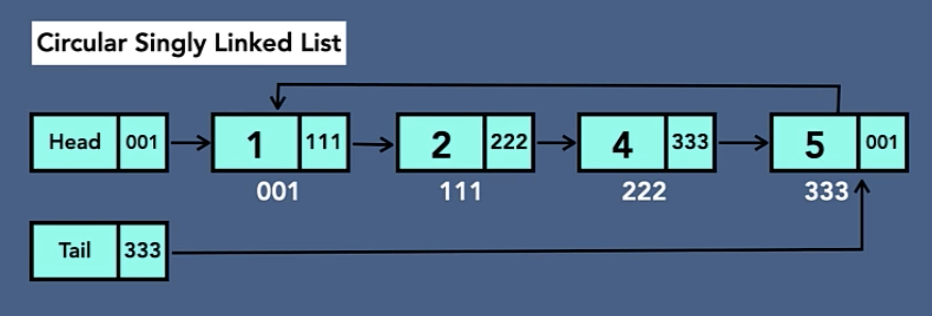
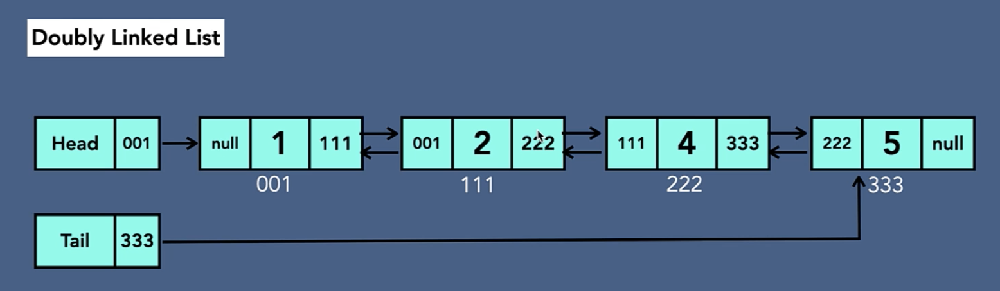
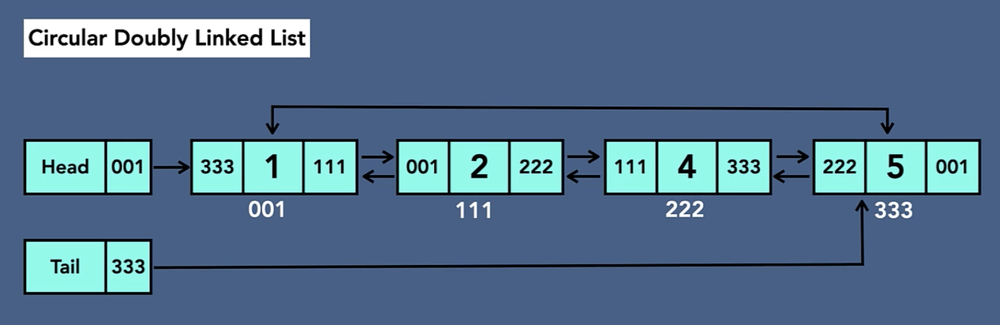

# 9장 리스트

- [9장 리스트](#9장-리스트)
  - [배열 vs 리스트](#배열-vs-리스트)
  - [9-1 선형 리스트(Linear List)](#9-1-선형-리스트linear-list)
  - [9-2 연결 리스트(Linked List)](#9-2-연결-리스트linked-list)
    - [구성](#구성)
    - [종류](#종류)

## 배열 vs 리스트

- 배열
  - 물리적으로 연속된 요소들의 나열
  - 메모리상에서 연속된 주소값을 가짐
  - 접근 속도는 빠르고(인덱스값으로 원하는 요소 바로 접근) 삽입/삭제는 느림(데이터를 모두 옮겨야 함)
  - 생성시 크기를 지정
  - 각 요소가 독립적이지 않음 -> 값은 지울 수 있지만 메모리 공간은 계속 차지함
- 리스트
  - 논리적으로 연속된 요소들의 나열
  - 메모리 주소값이 불연속적, 랜덤하게 설정
  - 접근 속도는 느리고(앞에서부터 순차검색) 삽입/삭제는 빠름(원하는 위치에 노드 삽입/삭제 후 링크만 연결)
  - 지정된 크기 없이 늘었다 줄었다 가능
  - 각 요소가 독립적 -> 요소를 삭제하면 메모리에서도 삭제됨

## 9-1 선형 리스트(Linear List)

- 배열 같이 연속된 요소가 순서대로 나열된 자료구조
- 위에 있는 배열의 특징을 가짐

## 9-2 연결 리스트(Linked List)

### 구성

- 연결 리스트는 노드를 요소로 가진다.
- 첫번째 노드를 가리키는 `head`, 마지막 노드를 가리키는 `tail`, 리스트의 크기가 저장되는 `size` 변수를 가진다.
- 각 노드는 값이 저장되는 `value` 변수와 다음 노드를 가리키는 `next` 변수를 가진다.

### 종류

- 단일 연결 리스트(Sigly Linked List)

  

- 단일 원형 연결 리스트(Circular Singly Linked List)

  

- 이중 연결 리스트(Doublly Linked List)

  

- 이중 원형 연결 리스트(Circular Doublly Linked List)

  
