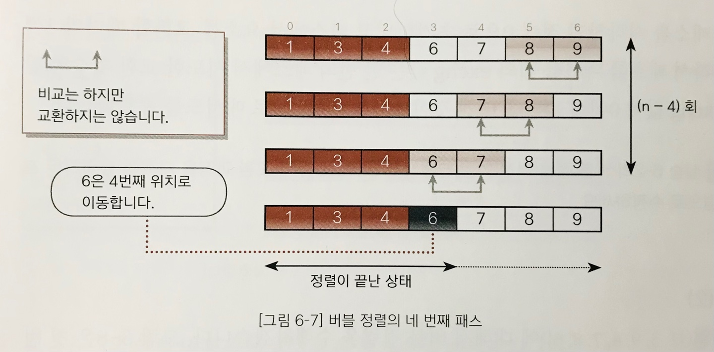
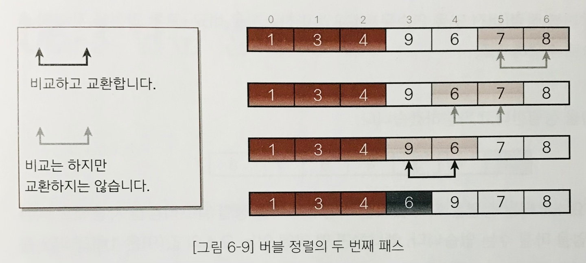
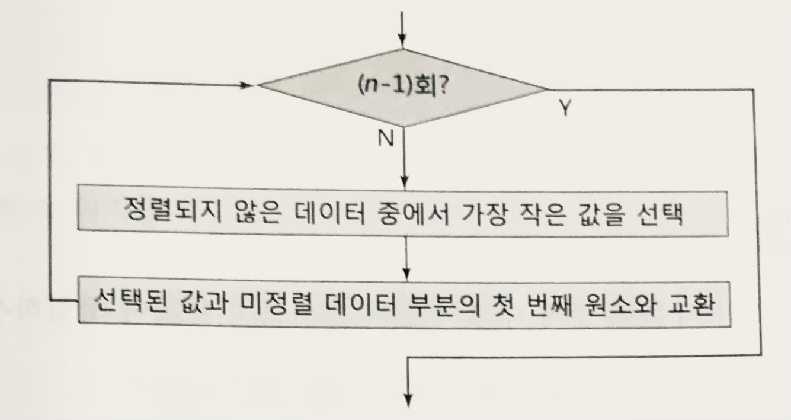
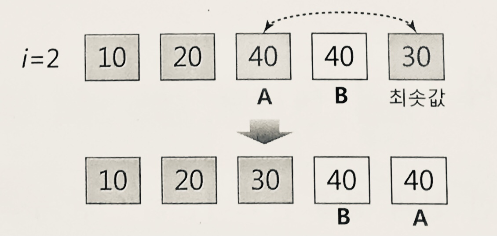

# 6장 6-2~4 단순정렬

- [6장 6-2~4 단순정렬](#6장-6-24-단순정렬)
  - [6-2 버블 정렬 Bubble Sort](#6-2-버블-정렬-bubble-sort)
    - [개념과 원리](#개념과-원리)
    - [특징](#특징)
    - [알고리즘 개선](#알고리즘-개선)
      - [개선 1](#개선-1)
      - [개선 2](#개선-2)
  - [6-3 단순 선택 정렬 Straight Selection Sort](#6-3-단순-선택-정렬-straight-selection-sort)
    - [게념과 원리](#게념과-원리)
    - [특징](#특징-1)
  - [6-4 단순 삽입 정렬 Straight Insertion Sort](#6-4-단순-삽입-정렬-straight-insertion-sort)
    - [게념과 원리](#게념과-원리-1)
    - [특징](#특징-2)

## 6-2 버블 정렬 Bubble Sort

### 개념과 원리

- 인접한 두 값을 비교해서 교환을 반복해 정렬하는 방식
- 비교 및 교환 작업을 수행하는 일련의 과정을 패스라고 한다.
- n개의 요소를 가진 배열에서 패스를 k번 수행하면 k개의 요소가 정렬되고, 모든 정렬이 끝나려면 n-1회의 패스가 수행되어야 한다.

### 특징

- 시간 복잡도: O(n2)
- 안정적 정렬 알고리즘
  - 인접한 두 데이터가 정렬되지 않은 경우에만 교환 발생
- 제자리 정렬 알고리즘

### 알고리즘 개선

#### 개선 1

- 패스를 거치면서 교환 작업이 일어나지 않은 경우 이미 정렬이 끝난 상태이므로 반복문을 빠져나오고 작업 종료

#### 개선 2

- 특정 시점 이후에 교환이 수행되지 않은 경우 이미 앞쪽의 요소는 정렬이 끝난 상태이므로 교환이 수행되지 않은 그 다음 요소부터 교환 작업 수행

## 6-3 단순 선택 정렬 Straight Selection Sort

### 게념과 원리

- 가장 작은 값을 가진 요소부터 차례대로 선택해서 나열하는 방식
- 입력 배열의 크기가 n일때,
  - 정렬되지 않은 데이터 중에서 가장 작은 값을 선택
  - 정렬되지 않은 부분의 첫 번째 요소와 교환
  - 위의 과정을 n-1회 반복

### 특징

- 시간 복잡도: O(n2)
- 데이터 입력 상태에 민감하지 않다
  - 정렬하려는 배열의 정렬순서에 무관하게 언제나 동일한 수행 시간을 갖는다.
  - 즉, 최소값을 찾는 과정에서 데이터가 정순, 역순, 임의순 상관 없이 항상 일정한 시간을 갖는다.
- 제자리 정렬 알고리즘
- 불안정적 정렬 알고리즘(정렬 전 순서 유지 보장x)

## 6-4 단순 삽입 정렬 Straight Insertion Sort

### 게념과 원리

- 주어진 데이터의 요소 하나를 선택해서 데이터가 정렬된 형태를 갖도록 선택한 요소를 바른 위치에 삽입해서 나열하는 방식
- 입력 배열의 크기가 n일 때,
  - 배열을 정렬 부분과 미정렬 부분으로 구분
  - 미정렬 부분의 첫번째 요소를 선택
  - 선택한 요소를 정렬 부분의 알맞은 위치에 삽입
  - 위의 과정을 n-1회 반복

### 특징

- 시간 복잡도: O(n2)
- 입력 배열이 거의 정렬된 경우 빠른 수행시간 O(n)을 갖는다.
- 데이터 정렬 상태에 따라 수행 시간이 달라진다.
  - 역순 정렬 상태인 경우, 최악의 수행시간 O(n2)
  - 정순 정렬 상태인 경우, 다른 정렬 알고리즘보다 빠른 수행시간 O(n)
